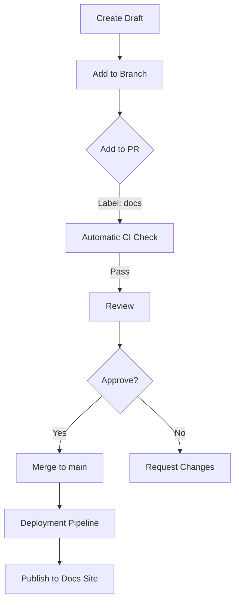

# 📑 Project Relife Clinic OS – Documentation Guidelines  

> *This document explains how to complete documentation tasks in accordance with Relife Clinic OS project standards. It is meant for all contributors (developers, QA, PMs, technical writers) who need to create, review, or approve documentation.*  

---

## Table of Contents
| # | Section | Description |
|---|---------|-------------|
| 1 | 🎯 Purpose | Why we document |
| 2 | 📄 Scope | What gets documented |
| 3 | 📌 Terminology | Key terms & abbreviations |
| 4 | 📋 Documentation Standards | Style, formatting, and consistency |
| 5 | 🔄 Process Flow | Steps from creation to publication |
| 6 | 🛠️ Tools & Templates | Markdown, Git, CI, etc. |
| 7 | 👥 Roles & Responsibilities | Who does what |
| 8 | 📑 Deliverables | Final artefacts |
| 9 | 🔍 Review & Approval | Quality gates |
| 10 | 📚 Reference & Resources | Links, docs, guidelines |
| 11 | 📎 Glossary | Bengali/English translation of terms |
| 12 | 🔗 Change Log | Version history of the doc |

---

## 1. 🎯 Purpose  
Documenting the Relife Clinic OS is essential for:

- **Transparency** – all stakeholders can understand the system.
- **Consistency** – a shared understanding of APIs, architecture, and UX.
- **Compliance** – meets medical‑software regulatory requirements.
- **Maintainability** – aids onboarding, debugging, and future enhancements.

---

## 2. 📄 Scope  
All project documentation that influences the development lifecycle:

| Category | Example |
|----------|---------|
| **Architecture** | System diagrams, component interactions |
| **API Docs** | REST/GraphQL endpoints, payloads |
| **User Manuals** | End‑user and admin guides |
| **Testing Docs** | Test plans, test cases, automation scripts |
| **Deployment Guides** | Docker, Kubernetes, CI/CD pipelines |
| **Regulatory** | HIPAA compliance, audit trails |
| **Release Notes** | Version history, bug fixes, feature adds |

> **Note**: Non‑technical docs (marketing, business) are outside this scope.

---

## 3. 📌 Terminology  

| English | Bengali | Description |
|---------|---------|-------------|
| **Doc** | ডক | Documentation file |
| **CI** | কন্টিনিউয়াস ইন্টিগ্রেশন | Automated build & test pipeline |
| **PR** | পুল রিকোয়েস্ট | Code/Doc merge request |
| **Version** | সংস্করণ | Release number (e.g., v2.3.1) |

> **Tip**: Keep a **terminology sheet** in the `docs/` folder – `TERMINOLOGY.md`.

---

## 4. 📋 Documentation Standards  

| Standard | Detail | Example |
|----------|--------|---------|
| **File Naming** | Use lowercase, hyphens, and a short prefix. | `api-users.md` |
| **Header Hierarchy** | H1 for document title, H2 for major sections, H3 for subsections. | `# API Overview` |
| **Code Blocks** | Use fenced triple backticks with language hint. | ```python |
| **Linking** | Use relative links for internal docs. | `[User Flow](/docs/user-flow.md)` |
| **Versioning** | Each file must contain a `Last Updated` and `Version` field. | `Last Updated: 2026-08-08` |
| **Style** | Follow the [Relife Style Guide](https://relife.os/docs/style-guide.md) – consistent tense, voice, and terminology. | Active voice preferred. |

---

## 5. 🔄 Process Flow  



1. **Create Draft** – Open a new markdown file under `docs/`.
2. **Branch** – `docs/<topic>` to keep docs separate from code.
3. **Pull Request** – Label with `docs`.
4. **CI Check** – Lint (`markdownlint`), spell‑check, link‑check.
5. **Review** – Assigned reviewer (tech writer or subject‑matter expert).
6. **Approval** – Two approvals required unless the doc is trivial.
7. **Merge** – Into `main` → triggers static‑site generation.
8. **Publish** – Docs live at `https://relife.os/docs`.

---

## 6. 🛠️ Tools & Templates  

| Tool | Purpose | Setup |
|------|---------|-------|
| **Markdown** | Primary format | All docs are `.md` |
| **GitHub Actions** | CI checks | `docs-check.yml` in `.github/workflows/` |
| **MkDocs** | Site generator | `mkdocs.yml` config |
| **markdownlint** | Style linting | `package.json` script `lint:md` |
| **Husky** | Pre‑commit hooks | `husky install` |
| **Docs Templates** | Reuse structure | `docs/templates/` |
| **PlantUML** | Diagrams | `*.puml` files in `diagrams/` |
| **OpenAPI Spec** | API docs | `api-spec.yaml` |

### Example `docs/templates/api.md`
```markdown
# API – <Endpoint>

## URL
`<Method> /api/<resource>`

## Description
<Short description>

## Parameters
| Name | Type | Required | Description |
|------|------|----------|-------------|

## Request Body
<Schema example>

## Response
| Status | Body |
|--------|------|

## Example Request
```bash
curl -X <Method> https://api.relifecare.com/api/<resource> \
  -H "Authorization: Bearer <token>" \
  -d '{"key":"value"}'
```

## Notes
- …

```

---

## 7. 👥 Roles & Responsibilities  

| Role | Primary Duties |
|------|----------------|
| **Tech Writer** | Create & maintain docs, enforce style guide. |
| **Developer** | Provide technical accuracy, review code‑related docs. |
| **QA Engineer** | Validate test‑related documentation, link test cases. |
| **Product Owner** | Approve user‑facing docs, ensure alignment with requirements. |
| **Compliance Officer** | Verify regulatory docs, audit trails. |
| **Release Manager** | Trigger docs build during release. |

---

## 8. 📑 Deliverables  

| Deliverable | Description | Format |
|-------------|-------------|--------|
| **Architectural Overview** | System high‑level design | Markdown + diagrams |
| **API Reference** | Endpoint specs | Markdown + Swagger UI |
| **User Manual** | End‑user guide | Markdown + PDF |
| **Deployment Guide** | CI/CD pipeline | Markdown |
| **Test Plan** | Manual & automated tests | Markdown |
| **Release Notes** | Version changelog | Markdown |
| **Regulatory Statements** | Compliance evidence | Markdown + PDFs |

---

## 9. 🔍 Review & Approval  

| Stage | Approver | Criteria |
|-------|----------|----------|
| **Initial Review** | Tech Writer Lead | Completeness, correctness |
| **Peer Review** | Fellow Contributor | Style, consistency |
| **Subject Matter** | Domain Expert | Technical fidelity |
| **Compliance Review** | Compliance Officer | HIPAA/ISO alignment |
| **Final Approval** | Product Owner | Business alignment |

- **Mandatory** approvals: Tech Writer Lead, Product Owner.  
- **Optional**: QA & Compliance for docs affecting tests or regulations.

---

## 10. 📚 Reference & Resources  

- **Relife Style Guide** – `https://relife.os/docs/style-guide.md`  
- **Markdown Lint Rules** – `https://github.com/markdownlint/markdownlint`  
- **OpenAPI Spec** – `https://relife.os/docs/api-spec.yaml`  
- **PlantUML Documentation** – `https://plantuml.com/`  
- **MkDocs Docs** – `https://www.mkdocs.org/`  
- **CI Pipeline** – `https://github.com/relife/os/.github/workflows/docs-check.yml`

---

## 11. 📎 Glossary (English ↔ Bengali)

| English | Bengali | Comment |
|---------|---------|---------|
| **Documentation** | ডকুমেন্টেশন | |
| **Architecture** | আর্কিটেকচার | |
| **API** | এপিআই | |
| **Compliance** | কমপ্লায়